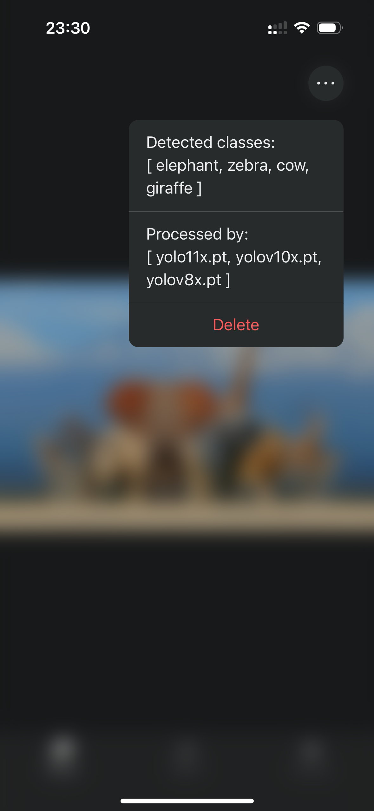
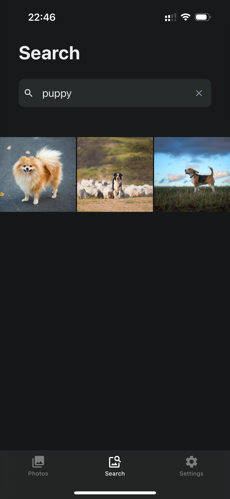
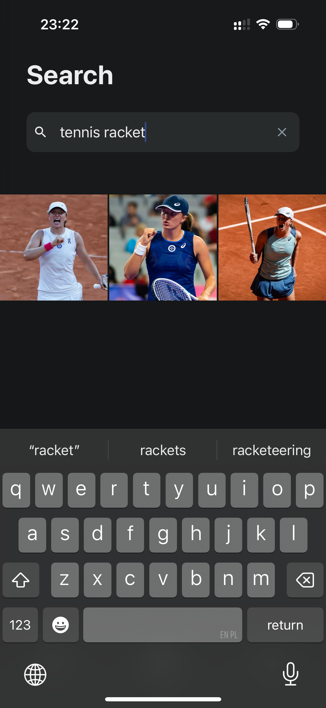
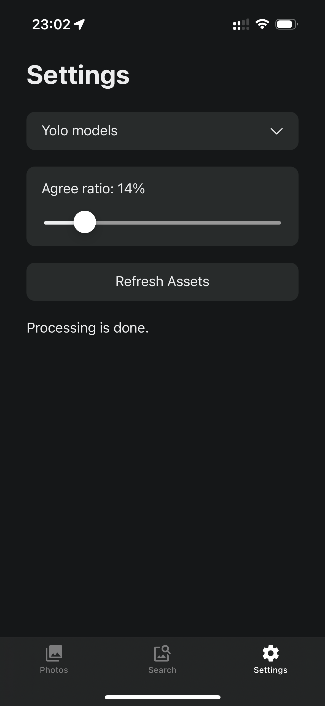
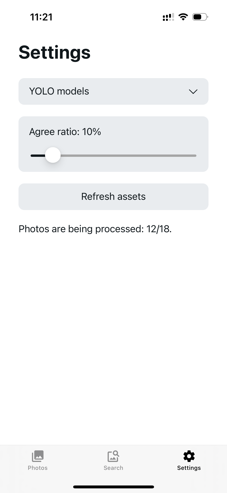

# PhotoRecall.Frontend

**PhotoRecall.Frontend** is a React Native app developed as part of the larger **PhotoRecall** project. This project aims to create an intelligent gallery app that uses AI features for interacting with photo collections.

## Features
- **Gallery Navigation**: Enables users to easily browse, view, and zoom in on their photos.
- **Automatic Photo Fetching**: Automatically syncs with the user's camera roll to retrieve photos as they are taken.
- **AI Photo Recognition**: Recognizes objects in photos using various models, allowing users to choose the type of model they want to use and configure them as needed.
- **Smart Search Algorithm**: Enables users to search photos based on their content, including using synonyms of class names.
- **Themed Views**: Offers both light and dark themes to enhance the user experience.

## Compatibility

This app has been **tested only on iOS**. Other platforms may require additional testing or configuration.

## Installation and Running

1.  **Clone the Repository**

    ```bash
    git clone https://github.com/bartekbiz/PhotoRecall.Frontend.git  
    cd PhotoRecall.Frontend
    ```

2.  **Install Dependencies**  
    Ensure you have `node` and `npm` installed. Then run:

    ```bash
    npm install  
    ```

3.  **Start the App**  
    Start the Expo development server:

    ```bash
    npx expo start  
    ```
    In the output, you'll find options to open the app in a:
    - [development build](https://docs.expo.dev/develop/development-builds/introduction/),
    - [iOS simulator](https://docs.expo.dev/workflow/ios-simulator/),
    - [Android emulator](https://docs.expo.dev/workflow/android-studio-emulator/),
    - [Expo Go](https://expo.dev/go), a limited sandbox for trying out app development with Expo.


## Available Views

### 1. **Gallery Home**

Displays the main gallery interface for browsing photos. Allows to zoom the photos, view them in focus mode (all icons hidden except for the photo), show information about them. Automatically updates as new photos are taken.

<div style="display: flex; justify-content: space-around;">
  
  
</div>

### 2. **Search View**

Enables photo search functionality, leveraging AI predictions for better accuracy.

<div style="display: flex; justify-content: space-around;">
    
    
</div>

### 3. **Settings**

Manage app settings, including themes and preferences.

<div style="display: flex; justify-content: space-around;">
    
    
</div>

## API Integration

This app communicates with the [PhotoRecall.API](https://github.com/bartekbiz/PhotoRecall.API) for:

- Getting predictions for photos.
- Fetching list of available AI models.
- Getting advanced search results with support for class synonyms.

## License

This project is licensed under the GNU General Public License v3.0 or later. See LICENSE to see the full text.
